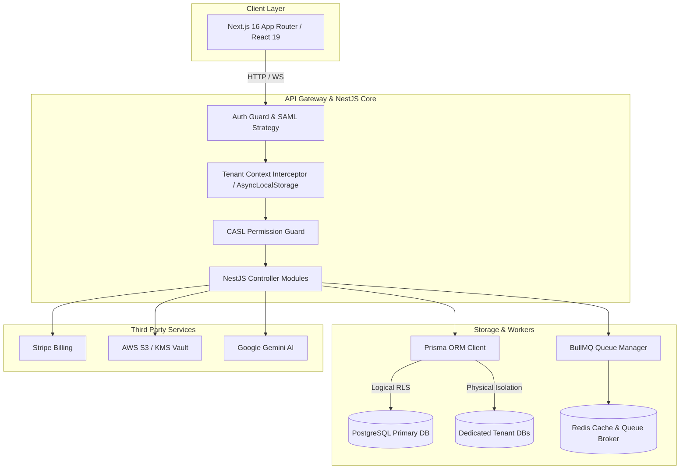

# Architecture & Deep-Dive System Design

This document provides a comprehensive technical overview of the **Enterprise Multi-Tenant SaaS Platform** architecture, detailing data isolation strategies, authentication flows, authorization mechanics, background job processing, and deployment architecture.

---

## 📐 High-Level Architectural Model

The platform follows a clean monorepo architecture separating the frontend client application, API backend services, background workers, state stores, and external integrations.



---

## 🏢 Multi-Tenancy Design Patterns

The system supports a flexible hybrid multi-tenancy model:

### 1. Logical Data Isolation (Shared Database, Separate Schemas)
- All shared tables contain an `organizationId` foreign key mapped to the `Organization` model.
- Prisma Query Extensions dynamically inject `where: { organizationId }` filters on every read/write operation.
- Request contexts store the active tenant state using NestJS `AsyncLocalStorage` (`nestjs-cls`).

### 2. Physical Data Isolation (Dedicated Database Connection)
- Enterprise tenants can be configured with an explicit `databaseUrl` connection string on the `Organization` record.
- Dynamic DB pool switching routes queries for high-compliance tenants to dedicated database clusters.

```sql
-- Organization Model Tenant Overview
Organization
 ├── id (UUID v4)
 ├── name & slug
 ├── subscriptionStatus & subscriptionTier
 ├── parentId (Hierarchical Orgs)
 ├── databaseUrl (Physical isolation connection string)
 ├── customDomain (CNAME routing)
 ├── brandColorPrimary & logoUrl (White-labeling)
 └── allowedIPs & whitelistedDomains (Network security)
```

---

## 🔐 Security & Access Control Mechanics

### Role-Based Access Control (RBAC) via CASL

Authorization is evaluated dynamically using `@casl/ability`. Permissions are determined based on:
1. System Roles: `SUPER_ADMIN`, `ADMIN`, `MANAGER`, `MEMBER`.
2. Custom Roles: Organization-level custom permissions defined in `UserRoleMapping` and `Role` entities.

```typescript
// Example CASL Ability Definition
can(Action.Update, Project, { organizationId: user.organizationId });
can(Action.Manage, Organization, { id: user.organizationId });
```

### Authentication Pipeline
- **JWT Tokens**: Short-lived Access Tokens (15m) paired with encrypted Refresh Tokens stored in Redis.
- **SAML 2.0 / SSO**: Passport SAML integration (`@node-saml/passport-saml`) supporting enterprise IdPs (Okta, Azure AD).
- **MFA / 2FA**: Time-based One-Time Passwords (TOTP) validated via `otplib`.

---

## 🔄 Background Job Queues & Webhooks

Async operations (bulk email dispatch, data export processing, audit log flushing, SIEM webhook calls) are delegated to background job workers via **BullMQ** and **Redis**.

* **Audit Logs**: High-volume mutation events write asynchronously to Redis queues before batch flushing to PostgreSQL to prevent request latency.
* **Webhook Retry Strategy**: Exponential backoff retries for failed tenant webhooks with HMAC SHA-256 signature headers.

---

## 🌐 White-Labeling & Multi-Region Support

1. **Custom Domain Routing**: Edge routers map incoming Host headers (`tenant.customdomain.com`) to the corresponding organization record.
2. **Dynamic UI Theme Injection**: Dynamic CSS variable override at runtime applying tenant `brandColorPrimary`, `brandColorSecondary`, and `logoUrl`.
3. **Multi-Region Tagging**: Tenants can be assigned to `US`, `EU`, or `ASIA` storage groups to comply with GDPR, HIPAA, and regional data residency mandates.

---

## 🚀 Infrastructure & Deployment Topology

- **Containerization**: Multi-stage `Dockerfile` optimizing production image size.
- **Kubernetes / Helm**: Standardized Helm charts for deployment, service routing, Horizontal Pod Autoscaling (HPA), and ingress controller setup.
- **Terraform**: Provisioning cloud infrastructure resources (AWS EKS cluster, S3 buckets, KMS keys, PostgreSQL RDS).
